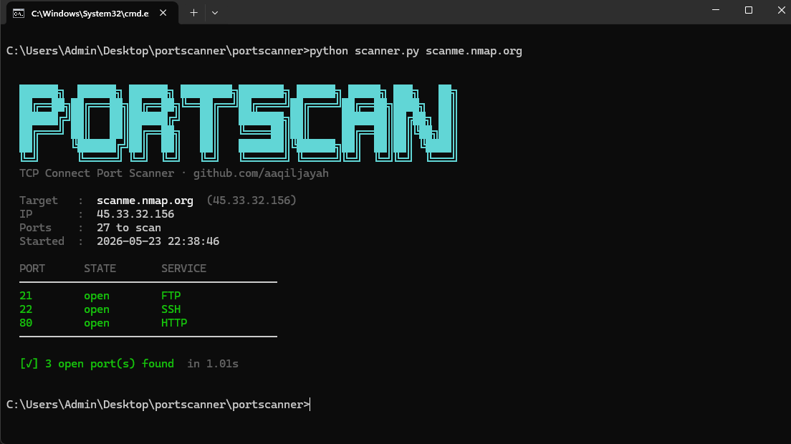

# portscanner

A lightweight TCP connect port scanner built in Python — no external dependencies, just the standard library.

Built from scratch to understand what's happening under the hood rather than just running nmap.

---

## Features

- TCP connect scan with configurable timeout
- Multi-threaded for fast scanning
- 27 common ports with service name detection
- Flexible port input — single, list, or range
- Clean colour-coded CLI output

---

## Usage

```bash
# Scan common ports (default)
python scanner.py scanme.nmap.org

# Scan a specific port
python scanner.py 192.168.1.1 -p 80

# Scan a range
python scanner.py 192.168.1.1 -p 1-1024

# Scan a custom list
python scanner.py 192.168.1.1 -p 22,80,443,8080

# Adjust timeout and threads
python scanner.py scanme.nmap.org -t 0.5 --threads 200
```

## Options

| Flag | Default | Description |
|------|---------|-------------|
| `-p` | `common` | Ports to scan — `common`, single, list, or range |
| `-t` | `1.0` | Timeout per port in seconds |
| `--threads` | `100` | Number of concurrent threads |
| `-h` | — | Help |

---

## Example Output



---

## How it works

For each port, a raw TCP socket attempts a full three-way handshake (`connect_ex`). If the handshake completes, the port is open. If it times out or is refused, it's closed or filtered. All ports are scanned concurrently using a thread pool.

---

## Legal

Only scan hosts you own or have explicit permission to scan. Unauthorised port scanning may be illegal in your jurisdiction.

---

## Author

Aaqil Jayah · [github.com/aaqiljayah](https://github.com/aaqiljayah)
